# Transforming a GitHub / Gitlab Project to GCP using Google Source Repositories, Cloud Build and App Engine
Table of Contents:
- [Setting up the GCP-Console](https://github.com/Lukas-Blank/github-demo#setting-up-the-gcp-console)
- [Setting up Source Repositories](https://github.com/Lukas-Blank/github-demo#setting-up-source-repositories)
  - [GitHub](https://github.com/Lukas-Blank/github-demo#github)
  - [GitLab](https://github.com/Lukas-Blank/github-demo#gitlab)
- [Deploying to App Engine](https://github.com/Lukas-Blank/github-demo#deploying-to-app-engine)
- [Using Cloud Build for CI/CD](https://github.com/Lukas-Blank/github-demo#using-cloud-build-for-cicd)
## Setting up the GCP-Console 
Before we start to actually move our existing resources to GCP there are some pre-configurations to make inside the GCP-Console.
First of all, a project should have been created and a billing account has to be provisioned. Inside the created project the APIs have to be enabled. To enable specific APIs go to **APIs & Services -> Dashboard**, and press the **+ Enable APIs and Services** button.
These APIs have to be enabled:
-	Cloud Source Repositories API
-	App Engine Admin API
-	Cloud Build API
After activation your API-dashboard should look something like this: <br><br>
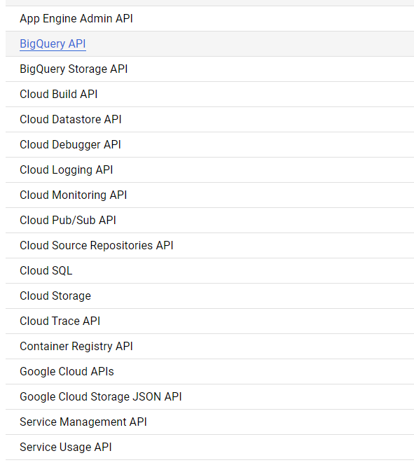 <br>
Next, we will give Cloud Build permission to access app engine through its service account. Go to **Cloud Build -> Settings** and for the GCP Service **App Engine** select **ENABLE**. Your settings should look like this: <br><br>
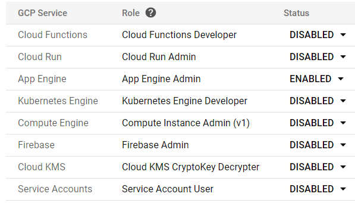 <br>
## Setting up Source Repositories
This demo will explain how to either mirror an existing GitHub-Project or an existing GitLab-Project.
### GitHub
If you are using an existing GitHub-Project you can mirror it to Google Source Repositories using the GCP-Console. Go to **Source Repositories** and select 
**Get started -> Create Repository**, or **Add Repository** if you have deployed a repository before. Now you should see something like this: <br><br>
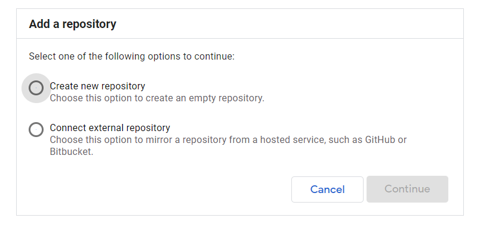 <br>
Select **Connect external repository**. <br>
Next, select the project you are working in and select GitHub as your Git provider. Furthermore, you have to authorize the selected project to store third-party authentication credentials. Your screen should look like this: <br><br>
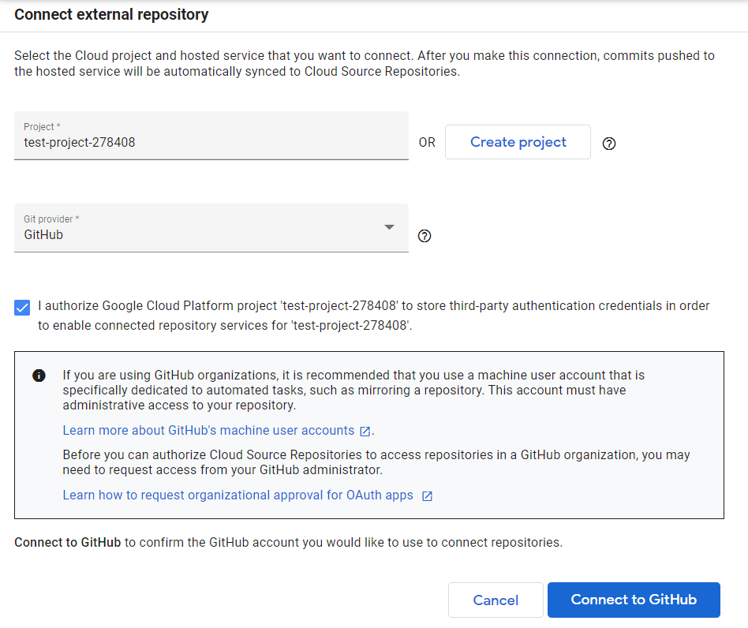 <br>
Now, click **Connect to GitHub** and select the GitHub-Project you want to mirror. Afterwards, click **Connect selected Repository**.
Your Cloud Repository should have been created with a name like: <br>
`github_$(GitHub-Username)_$(GitHub-Project-name)`
### GitLab
If you are using an existing GitLab-Project you will use the Cloud Shell to mirror the repository. Open up the Cloud Shell and make sure you are operating in the correct project. If not use this to switch the current project: <br>
<code>gcloud config set project $Project-ID</code><br>
Next, we will create an source repository which will become the mirror to your existing GitLab-Project. Enter: <br>
<code> gcloud source repos create $Source-Repository-Name </code><br>
Your source repository will be created. Next, we will create static login information to enable GitLab to push to the source repository. Go to **Source Respositories** so that you see all your source repositories in the recent project. You should now see the just created repository here. Click on it. You should see something like this:
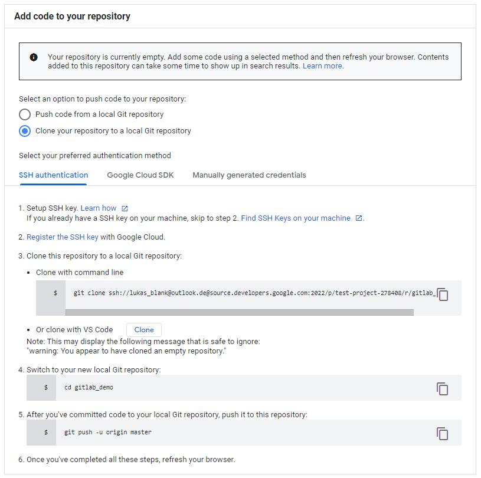 <br>
For **Select your preferred authentication method** select **Manually generated credentials** and then click **1. Generate and store your Git credentials**. The following popup will show up: <br><br>
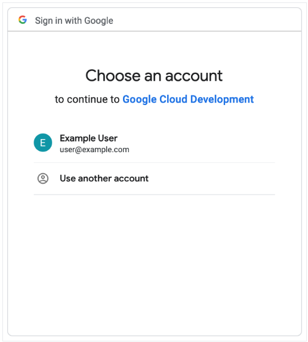 <br>
Select your Google account and continue on. Another popup will show up which you will pass through allowing Google Cloud Development to access your Google Account. From the following page copy the commands that should look something like this:<br><br>
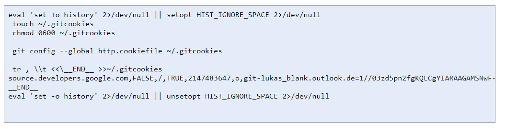 <br>
Next, copy the password you just created. To print it out to the cmd type:<br>
<code>grep 'source.developers.google.com' ~/.gitcookies | tail -1 | cut -d= -f2</code><br>
Save the username as environment variable via:<br>
<code>CSR_USER=$(grep 'source.developers.google.com' ~/.gitcookies | tail -1 | cut -d$'\t' -f7 | cut -d= -f1)</code><br>
Save the repo-url via:<br>
<code>CSR_REPO=$(gcloud source repos describe $Source-Repository-Name --format="value(url)")</code><br>
To print this out type:<br>
  <code>echo $CSR_REPO | sed "s/:\/\//:\/\/${CSR_USER}@/"</code><br>
You will need Username and password in the next steps so leave your cloud shell open for now.
Next, move to your desired GitLab-Project to **Settings -> Repository**.  Search for **Mirroring repositories** and click **Expand**. This should look like this: <br><br>
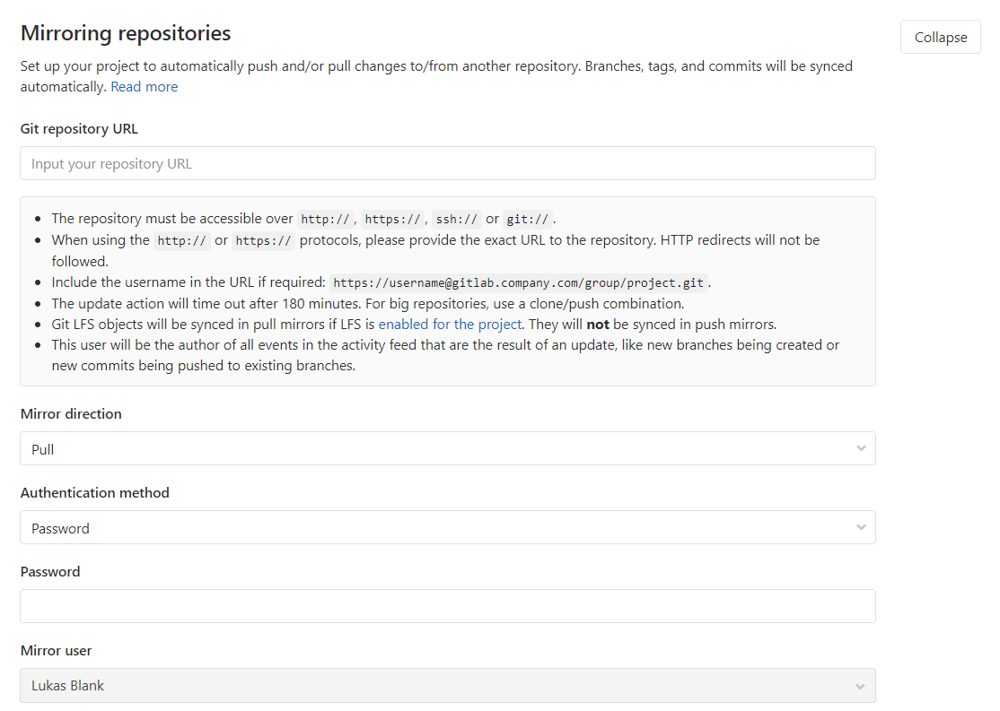 <br>
For **Git repository URL** copy the url from your cloud shell. For **Mirror direction** select Push. For **Authentication method** use password and copy the password from your cloud shell. Furthermore, if **Only mirror protected branches** is selected, remove it. Afterwards, click **Mirror repository** and if successful, you should see your repo like this: <br><br>
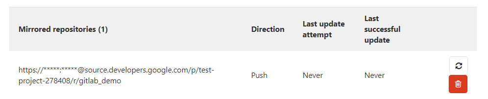 <br>
Now, to finish off the mirror-setup, make a change to your repo in GitLab (For example add something to your README.md) and commit the changes in your browser. Now, because this is the first time, to see those updates in the cloud source repositories as well, you will have to go through the next steps one last time.<br>
First, clone your repo locally via cloud shell:<br>
<code>git clone https://source.developers.google.com/p/$your-Project-ID/r/$your-source-repository-name</code><br>
Then move to into the repo:<br>
<code>cd $your-source-repository-name</code><br>
Finally execute a push:<br>
<code>git push -u origin master</code><br>
Now, if you go to your source repository again and refresh your browser your GitLab-Repository should be shown. If you got any errors or want to check the steps any further see this documentation: https://cloud.google.com/solutions/mirroring-gitlab-repositories-to-cloud-source-repositories.
## Deploying to App Engine
If you have not done so already, clone the repository to your cloud shell:<br>
<code>git clone https://source.developers.google.com/p/$your-Project-ID/r/$your-source-repository-name</code><br>
For this example a simple Hello-World-Angular-Project is going to be deployed. We move into out just cloned repository and install all the missing dependencies there: <br>
<code> npm install</code><br>
Next, we build a production-version of our angular app: <br>
<code>npm run build --prod</code><br>
This created a “dist” folder which we will be using. <br>
Next, create a configuration file for the app engine to specify how the deployment should look. <br>
app.yaml:
```yaml
runtime: python27
api_version: 1
threadsafe: true
handlers:
  - url: /
    static_files: dist/$angular-app-name/index.html # $angular-app-name => has to match with the folder the build created in dist/
    upload: dist$angular-app-name/index.html
  - url: /
    static_dir: dist/$angular-app-name
    
# skip_files can also be transfered into an .gcloudignore file
skip_files:
  - e2e/
  - node_modules/
  - src/
  - coverage
  - ^(.*/)?\..*$
  - ^(.*/)?.*\.md$
  - ^(.*/)?.*\.yaml$
  - ^LICENSE
  ```
  Now, lets deploy our app for the first time:<br>
  <code> gcloud app deploy app.yaml </code><br>
  If you are asked which region you want to deploy your app to select the desired one. You should see something like this: <br>
  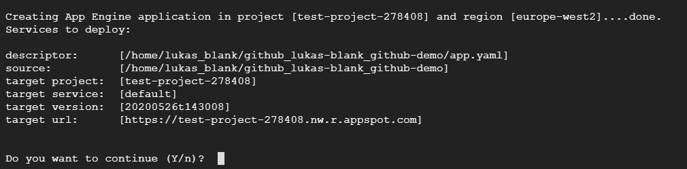 <br>
  Press Y to continue. After this has finished you should be able to see your deployed website. <br>
  For further information about how to write an app.yaml for more specific deployments see: https://cloud.google.com/appengine/docs/standard/python/config/appref
 
## Using Cloud Build for CI/CD
To tell Cloud Build what we want to do we create a cloudbuild.yaml:
```yaml
steps:
  - name: node:10.16.3 # tell node to use a recent version to prevent errors with node
    entrypoint: npm
    args: ['install']

  - name: node:10.16.3
    entrypoint: npm
    args: [run, build, --prod]

  - name: gcr.io/cloud-builders/gcloud
    args: [app, deploy, app.yaml]
```
For further documentation on how to write a cloudbuild.yaml look at: https://cloud.google.com/cloud-build/docs/build-config <br>
After creating this cloudbuild.yaml we will create a trigger, which will detect a push to the repository and execute the script to redeploy our app. Go to **Cloud Build -> Triggers** and press **Create Trigger**. Next, for **Name** enter a name for the trigger you are creating. As **Event** enter push to a branch for now. For **Source** select the repository. In **branch** enter the branch which should be affected by this trigger. And last, enter your path to the created cloudbuild.yaml beginning with a /.If you followed this tutorial you should be able to leave at its default value. The form should look something like this: <br><br>
  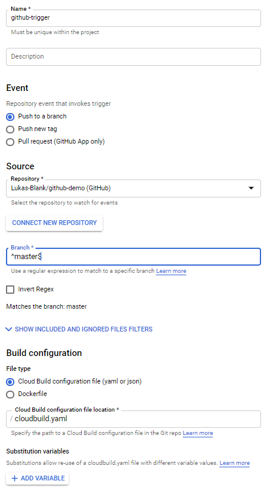 <br>
Finally, press **Create**. <br>
As the trigger is created we can continue and push our changes we made to our repository. This should already trigger the just created trigger. Make sure you are in your git root folder and type: <br>
<code>git add -A</code><br>
Then commit your changes: <br>
<code>git commit -m "commit message" </code><br>
Finally, push your changes. If you have worked via GitHub, you have to push to the real GitHub repository, because the Source Repository 
is only a mirror. Then type: <br>
<code>git push https://github.com/$Username/$REPO_Name</code><br>
If you were working on gitlab you can just push by using the previously used command:<br>
<code>git push -u origin master</code><br>
To check if everything deployed correctly go to **Cloud Build -> History** and click the one which has your repo as **Source**. If everything went well this should look like this: <br>
  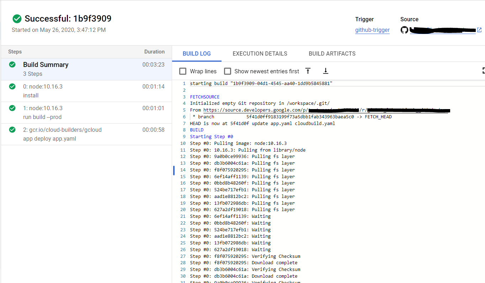 <br>
